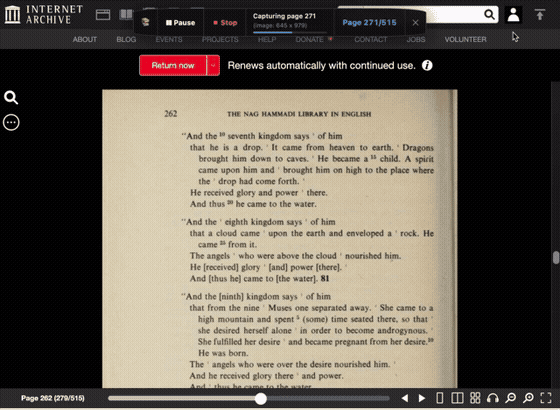

# Archive Downloader

> A lightweight, privacy-first browser extension for Chrome & Brave to archive complete volumes from **Internet Archive** and **HathiTrust** into high-resolution PDFs and clean OCR Markdown.



Please use this for your own use only, and respectfully. This code was written by Gemini 3.8 (under the skillful technical skills of Filipe Laborde). Written by an AI and abuse will be tracked by future surveillance state AI. ;)

---

## Why Archive Downloader?

Archiving books from digital libraries often requires clunky CLI scripts, Python dependencies, or raw image downloaders that leave your hard drive cluttered with thousands of loose files.

**Archive Downloader** runs 100% inside your browser:
- **No external binaries or Python** needed.
- **Fast, in-memory PDF assembly** with zero server roundtrips.
- **Searchable OCR Markdown** extracted on every page turn and ready for your notes.
- **Smart, respectful rate-limit handling** that follows library policies automatically.

---

## Core Features

- **Dual-Library Support**: Automatically detects metadata, volume IDs, and leaf structure on both **Internet Archive** (`archive.org/details/...`) and **HathiTrust** (`babel.hathitrust.org/cgi/pt?...`).
- **Floating In-Page Pill**: A clean, non-intrusive HUD on your page displaying live page counters, image dimensions, and download controls. Collapsible to a small docked book icon on the left edge.
- **In-Browser PDF Compiler**: Compiles high-resolution page scans into standardized, multi-page PDF documents in seconds directly in browser memory.
- **OCR to Markdown**: Captures underlying OCR text and figcaptions on every flip, decodes all HTML/XML entities, and builds a clean Markdown (`.md`) file with chapter/page headers.
- **Rate-Limit & Backoff Resilience**: Detects HTTP 429 and 5xx responses. Follows server `Retry-After` instructions with live countdowns (`35m Retrying: Rate Limited (server asked).`), adapting page pacing to protect your connection.
- **Privacy & Clean Storage**: Temporary page images are captured in memory and automatically cleaned up once the final `.pdf` is compiled.

---

## Quick Installation

### Option A: Download Pre-Built Extension (Fastest)
1. Download **`archive-downloader.zip`** from the latest [GitHub Releases](https://github.com/mindflowgo/archive-download-extension/releases) or the latest [GitHub Actions Artifacts](https://github.com/mindflowgo/archive-download-extension/actions).
2. Unzip `archive-downloader.zip` into a folder.
3. Open `chrome://extensions` (or `brave://extensions`) in your browser.
4. Enable **Developer mode** in the top-right corner.
5. Click **Load unpacked** and select the unzipped folder.

### Option B: Build from Source
1. Clone this repository:
   ```bash
   git clone https://github.com/mindflowgo/archive-download-extension.git
   ```
2. Install dependencies & build:
```bash
# Install dependencies (requires Bun or Node)
bun install

# Run unit and integration tests (25 passing tests)
bun test

# Build extension bundle
bun extension/build.ts
```

---

## How to Use

1. **Open Any Book**:
   - Internet Archive: `https://archive.org/details/[identifier]`
   - HathiTrust: `https://babel.hathitrust.org/cgi/pt?id=[identifier]`
2. **Start Downloading**:
   - Click the **`[▶ Start]`** button on the in-page pill or in the extension popup.
   - Click **`⚙` (Settings)** to adjust your save folder, filename patterns (`{title}_{id}`), page ranges, or image quality.
3. **Open Your Files**:
   - When capture completes, click **`[Downloaded]`** to open macOS Finder or Windows Explorer directly to your completed PDF and Markdown notes.

---

## License

This project is licensed under the MIT License. Developed for research, education, and personal public domain preservation.
